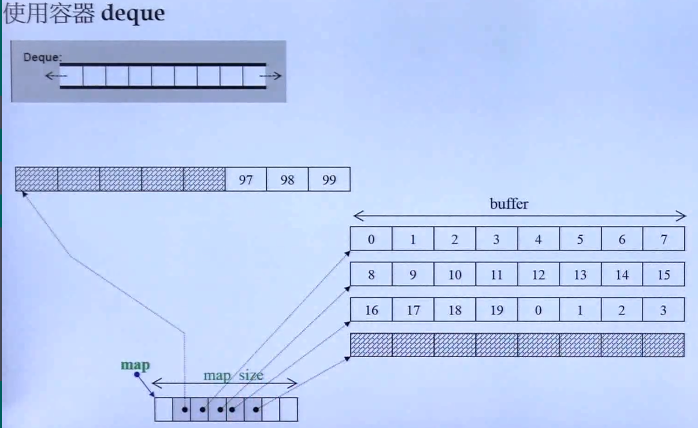

# C++STL体系结构与内核分析
C++标准库 > STL

> 先感受一下

``` c++
#include <iostream>
#include <vector>
#include <functional>
#include <algorithm>

using namespace std;

int main(int argc, char *argv[]) {

  int ia[6] = {27, 210, 12, 47, 109, 83};
  vector<int, allocator<int>> vi(ia, ia+6);

  cout << count_if(vi.begin(), vi.end(), not1(bind2nd(less<int>(), 40)));

  return 0;
}

```


## 容器
- Array
- Vector
- Dqueue
- List
- Forward-List

- Set/Multiset
- Map/Multimap

### 各种测试

工具函数

``` c++
namespace util{
  long get_a_target_long() {
    long target = 0;
    cout << "target (0~" << RAND_MAX << "): ";
    cin >> target;
    return target;
  }

  string get_a_target_string() {
    long target = 0;
    char buf[10];

    cout << "target (0~" << RAND_MAX << "): ";
    cin >> target;
    snprintf(buf, 10, "%ld", target);
    return string(buf);
  }

  int compareLongs(const void* a, const void* b) {
    return (*(long*)a - *(long*)b);
  }

  int compareStrings(const void* a,const void* b) {
    if (*(string*)a > *(string*)b) {
      return 1;
    } else if (*(string*)a < *(string*)b) {
      return -1;
    } else {
      return 0;
    }
  }
}


```

> 非关联性容器

- Array

``` c++
#include <array>
#include <cstdlib>
#include <ctime>
#include <string>
#include <iostream>
#include <vector>
#include <functional>
#include <algorithm>

using namespace std;

const long ASIZE = 10000 *50;

namespace array_test {
  void test_array() {
    cout << "test_array()...........\n";
    array<long, ASIZE> c;

    clock_t timeStart = clock();
    for (long i = 0;i < ASIZE;i++) {
      c[i] = rand();
    }
    cout << "milli-seconds: " << (clock() - timeStart) << endl;
    cout << "array.size(): " << c.size() << endl;
    cout << "array.front(): " << c.front() << endl;
    cout << "array.back(): " << c.back() << endl;
    cout << "array.data(): "  << c.data() << endl;

    long target = util::get_a_target_long();
    timeStart = clock();
    qsort(c.data(), ASIZE, sizeof(long), util::compareLongs);
    long* pItem = (long*)bsearch(&target, (c.data()), ASIZE, sizeof(long), util::compareLongs);

    cout << "qsort() + bsearch(), milli-seconds : " << (clock() - timeStart) << endl;

    if (pItem != nullptr) {
      cout << "found, " << *pItem << endl;
    } else {
      cout << "not found!" << endl;
    }
  }
}

int main(int argc, char *argv[]) {

  array_test::test_array();
  return 0;
}

```

- Vector

``` c++

namespace vector_test {
  void test_vector() {
    long value;
    cout << "test_vector()...\n";
    cin >> value;
    vector<string> c;
    char buf[10];

    clock_t timeStart = clock();
    for (long i = 0;i < value;++i) {
      try {
        snprintf(buf, 10, "%d", rand());
        c.push_back(string(buf));
      } catch (exception& p) {
        cout << "i=" << i << " "<< p.what() << endl;
        abort();
      }
    }
    cout << "mill-seconds: " << (clock() - timeStart) << endl;
    cout << "vector.size(): " << c.size() << endl;
    cout << "vector.front(): " << c.front() << endl;
    cout << "vector.back(): " << c.back() << endl;
    cout << "vector.data(): " << c.data() << endl;
    cout << "vector.capacity(): " << c.capacity() << endl;

    string target = util::get_a_target_string();
    {
      timeStart = clock();

      vector<string>::iterator pItem = ::find(c.begin(), c.end(), target);
      cout << "::find(), mill-seconds: " << (clock() - timeStart) << endl;

      if (pItem != c.end()) {
        cout << "found, " << *pItem << endl;
      } else {
        cout << "not found" << endl;
      }
    }

    {
      timeStart = clock();
      sort(c.begin(), c.end());
      string *pItem = (string *)bsearch(&target, (c.data()), c.size(),
                                        sizeof(string), util::compareStrings);
      cout << "sort-bsearch(), mill-seconds: " << (clock() - timeStart) << endl;
      if (pItem != nullptr) {
        cout << "found, " << *pItem << endl;
      } else {
        cout << "not found" << endl;
      }
    }
  }
}

int main(int argc, char *argv[]) {

  vector_test::test_vector();
  return 0;
}

```

- list

``` c++

#include <list>
namespace list_test {
void test_list() {
  cout << "test_list()...\n";
  list<string> c;
  char buf[10];

  clock_t timeStart = clock();
  for (long i = 0; i < ASIZE; ++i) {
    try {
      snprintf(buf, 10, "%d", rand());
      c.push_back(string(buf));
    } catch (exception &p) {
      cout << "i=" << i << " " << p.what() << endl;
      abort();
    }
  }
  cout << "mill-seconds: " << (clock() - timeStart) << endl;
  cout << "list.size(): " << c.size() << endl;
  cout << "list.max_size(): " << c.max_size() << endl;
  cout << "list.front(): " << c.front() << endl;
  cout << "list.back(): " << c.back() << endl;

  string target = util::get_a_target_string();
  {
    timeStart = clock();

    list<string>::iterator pItem = ::find(c.begin(), c.end(), target);
    cout << "::find(), mill-seconds: " << (clock() - timeStart) << endl;

    if (pItem != c.end()) {
      cout << "found, " << *pItem << endl;
    } else {
      cout << "not found" << endl;
    }
  }

  {
    timeStart = clock();
    c.sort();
    cout << "sort-bsearch(), mill-seconds: " << (clock() - timeStart) << endl;
  }
}
} // namespace list_test

```

- forward_list

``` c++
namespace flist_test {
void test_flist() {
  cout << "test_flist()...\n";
  forward_list<string> c;
  char buf[10];

  clock_t timeStart = clock();
  for (long i = 0; i < ASIZE; ++i) {
    try {
      snprintf(buf, 10, "%d", rand());
      c.push_front(string(buf));
    } catch (exception &p) {
      cout << "i=" << i << " " << p.what() << endl;
      abort();
    }
  }
  cout << "mill-seconds: " << (clock() - timeStart) << endl;
  cout << "flist.max_size(): " << c.max_size() << endl;
  cout << "flist.front(): " << c.front() << endl;

  string target = util::get_a_target_string();
  {
    timeStart = clock();

    forward_list<string>::iterator pItem = ::find(c.begin(), c.end(), target);
    cout << "::find(), mill-seconds: " << (clock() - timeStart) << endl;

    if (pItem != c.end()) {
      cout << "found, " << *pItem << endl;
    } else {
      cout << "not found" << endl;
    }
  }

  {
    timeStart = clock();
    c.sort();
    cout << "sort-bsearch(), mill-seconds: " << (clock() - timeStart) << endl;
  }
}
} // namespace flist_test


```

- deque 



``` c++
#include <deque>

namespace deque_test {
void test_deque() {
  cout << "test_deque()...\n";
  deque<string> c;
  char buf[10];

  clock_t timeStart = clock();
  for (long i = 0; i < ASIZE / 2; ++i) {
    try {
      snprintf(buf, 10, "%d", rand());
      c.push_back(string(buf));
    } catch (exception &p) {
      cout << "i=" << i << " " << p.what() << endl;
      abort();
    }
  }
  for (long i = 0; i < ASIZE / 2; ++i) {
    try {
      snprintf(buf, 10, "%d", rand());
      c.push_front(string(buf));
    } catch (exception &p) {
      cout << "i=" << i << " " << p.what() << endl;
      abort();
    }
  }
  cout << "mill-seconds: " << (clock() - timeStart) << endl;
  cout << "deque.size(): " << c.size() << endl;
  cout << "deque.max_size(): " << c.max_size() << endl;
  cout << "deque.front(): " << c.front() << endl;
  cout << "deque.back(): " << c.back() << endl;

  string target = util::get_a_target_string();
  {
    timeStart = clock();

    deque<string>::iterator pItem = ::find(c.begin(), c.end(), target);
    cout << "::find(), mill-seconds: " << (clock() - timeStart) << endl;

    if (pItem != c.end()) {
      cout << "found, " << *pItem << endl;
    } else {
      cout << "not found" << endl;
    }
  }

  {
    timeStart = clock();
    sort(c.begin(), c.end());
    cout << "sort-bsearch(), mill-seconds: " << (clock() - timeStart) << endl;
  }
}
} // namespace deque_test

```

- stack

类似 使用 push 和 pop 进行操作

- queue
 
类似 使用 push 和 pop 进行操作


> 关联性容器

- multiset

``` c++

#include <set>
namespace multiset_test {
void test_multiset() {
  cout << "test_multiset()..... \n";
  multiset<string> c;
  char buf[10];

  clock_t timeStart = clock();
  for (long i = 0; i < ASIZE; i++) {
    try {
      snprintf(buf, 10, "%d", rand());
      c.insert(string(buf));
    } catch (exception &p) {
      cout << "i=" << i << " " << p.what() << endl;
    }
  }

  cout << "mill-seconds: " << (clock() - timeStart) << endl;
  cout << "multiset.size(): " << c.size() << endl;
  cout << "multiset.max_size(): " << c.max_size() << endl;
  string target = util::get_a_target_string();

  {
    timeStart = clock();

    multiset<string>::iterator pItem = ::find(c.begin(), c.end(), target);
    cout << "::find(), mill-seconds: " << (clock() - timeStart) << endl;

    if (pItem != c.end()) {
      cout << "found, " << *pItem << endl;
    } else {
      cout << "not found" << endl;
    }
  }

  {
    timeStart = clock();
    c.find(target);
    cout << "c.find(), mill-seconds: " << (clock() - timeStart) << endl;
  }
}

} // namespace multiset_test


```

- multimap 

``` c++
#include <map>
namespace multimap_test {
void test_multimap() {
  cout << "test_multiset()..... \n";
  multimap<long, string> c;
  char buf[10];

  clock_t timeStart = clock();
  for (long i = 0; i < ASIZE; i++) {
    try {
      snprintf(buf, 10, "%d", rand());
      c.insert(pair<long, string>(i, buf));
    } catch (exception &p) {
      cout << "i=" << i << " " << p.what() << endl;
    }
  }

  cout << "mill-seconds: " << (clock() - timeStart) << endl;
  cout << "multimap.size(): " << c.size() << endl;
  cout << "multimap.max_size(): " << c.max_size() << endl;
  long target = util::get_a_target_long();

  {
    timeStart = clock();
    c.find(target);
    cout << "c.find(), mill-seconds: " << (clock() - timeStart) << endl;
  }
}
} // namespace multimap_test


```

- unordered_mutilset (拉链法实现的一个hash table)

``` c++
#include <unordered_set>
namespace unordered_multiset_test {
void test_unoredered_multiset() {
  cout << "test_unoredered_multiset().....\n";
  unordered_multiset<string> c;
  char buf[10];

  clock_t timeStart = clock();
  for (long i = 0; i < ASIZE; i++) {
    try {
      snprintf(buf, 10, "%d", rand());
      c.insert(string(buf));
    } catch (exception &p) {
      cout << "i=" << i << " " << p.what() << endl;
    }
  }

  cout << "mill-seconds: " << (clock() - timeStart) << endl;
  cout << "unordered_multiset.size(): " << c.size() << endl;
  cout << "unordered_multiset.max_size(): " << c.max_size() << endl;
  cout << "unordered_multiset.bucket_count(): " << c.bucket_count() << endl;
  cout << "unordered_multiset.load_factor(): " << c.load_factor() << endl;
  cout << "unordered_multiset.max_load_factor(): " << c.max_load_factor()
       << endl;
  cout << "unordered_multiset.max_bucket_count(): " << c.max_bucket_count()
       << endl;

  for (unsigned i = 0; i < 20; i++) {
    cout << "B[" << i << "] hash " << c.bucket_size(i) << " elems\n";
  }
  string target = util::get_a_target_string();
  {
    timeStart = clock();

    auto pItem = ::find(c.begin(), c.end(), target);
    cout << "::find(), mill-seconds: " << (clock() - timeStart) << endl;

    if (pItem != c.end()) {
      cout << "found, " << *pItem << endl;
    } else {
      cout << "not found" << endl;
    }
  }

  {
    timeStart = clock();
    c.find(target);
    cout << "c.find(), mill-seconds: " << (clock() - timeStart) << endl;
  }
}
} // namespace unordered_multiset_test


```


- unordered_mutilmap (拉链法实现的一个hash table)

``` c++
#include <unordered_map>
namespace unordered_multimap_test {
void test_unoredered_multimap() {
  cout << "test_unoredered_multimap().......\n";
  unordered_multimap<long, string> c;
  char buf[10];

  clock_t timeStart = clock();
  for (long i = 0; i < ASIZE; i++) {
    try {
      snprintf(buf, 10, "%d", rand());
      c.insert(pair<long, string>(i, buf));
    } catch (exception &p) {
      cout << "i=" << i << " " << p.what() << endl;
    }
  }

  cout << "mill-seconds: " << (clock() - timeStart) << endl;
  cout << "unordered_multiset.size(): " << c.size() << endl;
  cout << "unordered_multiset.max_size(): " << c.max_size() << endl;
  cout << "unordered_multiset.bucket_count(): " << c.bucket_count() << endl;
  cout << "unordered_multiset.load_factor(): " << c.load_factor() << endl;
  cout << "unordered_multiset.max_load_factor(): " << c.max_load_factor()
       << endl;
  cout << "unordered_multiset.max_bucket_count(): " << c.max_bucket_count()
       << endl;

  for (unsigned i = 0; i < 20; i++) {
    cout << "B[" << i << "] hash " << c.bucket_size(i) << " elems\n";
  }
  long target = util::get_a_target_long();
  {
    timeStart = clock();
    c.find(target);
    cout << "c.find(), mill-seconds: " << (clock() - timeStart) << endl;
  }
}
} // namespace unordered_multimap_test


```


## 分配器


## 算法


## 迭代器
前闭后开 `[ )`

``` c++
Container<T> c;
...
Container<T> it = c.begin();
for (; it != c.end();++it){
    // 
}
```

``` c++
std::vector<double> vec;
...
for (auto elem : vec) {
  std::cout << elem << std::endl;
}

...
for (auto& elem : vec) {
  elem *= 3;
}
```


## 适配器


## 仿函数


