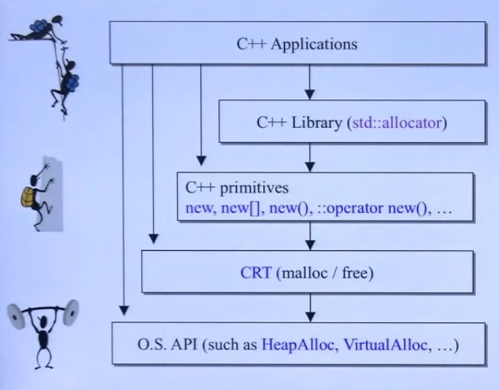
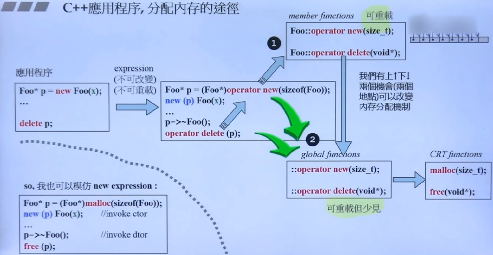

# c++ 内存管理

## 总览



|分配|释放|类别|可否重载|
|:-:|:-:|:-:|:-:|
|malloc()|free()|c函数|No|
|new|delete|c++表达式|No|
|::operator new()|::operator delete()|c++函数|Yes|
|allocator<T>::allocate()|allocator<T>::deallocate()|stl|不可以，但可以自由设计并以之搭配任何容器|

# primitives
## new 与 delete

> new

``` c++
Complex* pc = new Complex(1, 2);

// 编译器转换为类似下面的代码
Complex *pc;
try {
    void* mem = operator new( sizeof(Complex) ); // 分配内存
    pc = static_cast<Complex*>(mem); // 强制转型
    pc->Complex::Cpmplex(1, 2); // 调用构造函数
} cache(std::bad::alloc) {
    // 如果alloaction失败就不执行constructor
}
```

``` c++
void *operator(size_t size, const std::nothrow_t&) _THROE0() {
    void *p;
    while((p = malloc(size)) == 0) {
        _TRY_BEGIN
        _CACHE(std::bad_alloc)
        return(0);
        _CACHE_END;
    }
    return(p);
}
```


> delete

``` c++
Complex* pc = new Complex(1, 2);
delete pc;
```

``` c++
pc->~Complex(); // 调用析构函数
operator delete(pc); // 释放内存
```

``` c++
void __cdecl operator delete(void* p) _THROW0()
{
    free(p);
}
```

## array new 与 array delete

``` c++
Complex* pca = new Complex[3];

delete[] pca; // 唤起3次
```


## placement new

- placement new 允许我们建构于 allocated memory中
- 没有所谓 placement delete,因为placement new 根本没分配 memory. 亦或称呼 operator delete(size, void*) 为placement delete

``` c++
#include <new>

char* buf = new char[sizeof(Complex) * 3];
Complex* pc = new(buf)Complex(1, 2);
...
delete [] buf;
```

`Complex* pc = new(buf)Complex(1, 2);` 被编译器转化为

``` c++
Complex *pc;
try {
    void* mem = operator new( sizeof(Complex), buf); // 不分配内存
    pc = static_cast<Complex*>(mem); // 强制转型
    pc->Complex::Cpmplex(1, 2); // 调用构造函数
} cache(std::bad::alloc) {
    // 如果alloaction失败就不执行constructor
}
```

``` c++
void *operator(size_t, void* loc) {
    return loc;
}
```


## 重载



### 重载 ::operator new/delete/new []/delete[]

``` c++
namespace jj01 {
class Foo {
public:
  Foo() : _id(0) {
    cout << "default ctor.this=" << this << " id=" << _id << endl;
  }

  Foo(int i) : _id(i) { cout << "ctor.this=" << this << " id=" << _id << endl; }

  ~Foo() { cout << "dctor.this=" << this << " id=" << _id << endl; }

  static void *operator new(size_t);
  static void operator delete(void *, size_t);
  static void *operator new[](size_t);
  static void operator delete[](void *, size_t);

private:
  int _id;
  long _data;
  string _str;
};

inline void *Foo::operator new(size_t size) {
  Foo *p = (Foo *)malloc(size);
  cout << "operator new" << endl;
  return p;
}

inline void *Foo::operator new[](size_t size) {
  Foo *p = (Foo *)malloc(size);
  cout << "operator new[]" << endl;
  return p;
}

inline void Foo::operator delete(void *pdead, size_t size) {
  cout << "operator delete" << endl;
  free(pdead);
}

inline void Foo::operator delete[](void *pdead, size_t size) {
  Foo *p = (Foo *)malloc(size);
  cout << "operator delete[]" << endl;
  free(pdead);
}

} // namespace jj01


```

### 重载 new()/delete()

我们可以重载clas member operator(),写出多个版本，前提是每一个版本声明都必须有独特的参数列, **第一个参数必须是 size_t**

`Foo* pf = new(300, 'c')Foo;`

``` c++
namespace jj01 {
  class Bad{};
class Foo {
public:
  Foo() : _id(0) {
    cout << "default ctor.this=" << this << " id=" << _id << endl;
  }

  Foo(int i) : _id(i) {
    cout << "ctor.this=" << this << " id=" << _id << endl;
    throw Bad{};
  }

  ~Foo() { cout << "dctor.this=" << this << " id=" << _id << endl; }

  static void *operator new(size_t);
  static void *operator new(size_t, void *);
  static void *operator new(size_t, long);
  static void *operator new(size_t, long, char);

  static void operator delete(void *, size_t);
  static void operator delete(void *, void *);
  static void operator delete(void *, long);
  static void operator delete(void *, long, char);

  static void *operator new[](size_t);
  static void operator delete[](void *, size_t);

private:
  int _id;
  long _data;
  string _str;
};

inline void *Foo::operator new(size_t size) {
  Foo *p = (Foo *)malloc(size);
  cout << "operator new(size_t)" << endl;
  return p;
}

inline void *Foo::operator new(size_t size, void *start) {
  cout << "operator new(size_t, void*)" << endl;
  return start;
}

inline void *Foo::operator new(size_t size, long extra) {
  Foo *p = (Foo *)malloc(size + extra);
  cout << "operator new(size_t, long)" << endl;
  return p;
}

inline void *Foo::operator new(size_t size, long extra, char init) {
  Foo *p = (Foo *)malloc(size + extra);
  cout << "operator new(size_t, long, init)" << endl;
  return p;
}

inline void *Foo::operator new[](size_t size) {
  Foo *p = (Foo *)malloc(size);
  cout << "operator new[]" << endl;
  return p;
}

inline void Foo::operator delete(void *pdead, size_t size) {
  cout << "operator delete(void*, size_t)" << endl;
  free(pdead);
}

// 只有在构造函数中抛出异常的时候才会调用 placement delete
inline void Foo::operator delete(void *pdead, void *p) {
  cout << "operator delete(void*, void*)" << endl;
  free(pdead);
}

inline void Foo::operator delete(void *pdead, long extra) {
  cout << "operator delete(void*, long)" << endl;
  free(pdead);
}

inline void Foo::operator delete(void *pdead, long extra, char init) {
  cout << "operator delete(void*, long, char)" << endl;
  free(pdead);
}

inline void Foo::operator delete[](void *pdead, size_t size) {
  Foo *p = (Foo *)malloc(size);
  cout << "operator delete[]" << endl;
  free(pdead);
}

} // namespace jj01


```

``` c++

int main(int argc, char *argv[]) {
  jj01::Foo start;
  jj01::Foo* p1 = new(100)jj01::Foo(1);
  return 0;
}
```

## 设计分配器

### per-class allocator 1

``` c++
namespace jj02 {
class Screen {
public:
  Screen(int x) : i(x){};
  int get() { return i; }

  void *operator new(size_t);
  void operator delete(void *, size_t);

private:
  int i;
  Screen *next;
  static Screen *freeStore;     // 第一块空闲空间的指针
  static const int screenChunk; // chunk : 一大块
};

Screen *Screen::freeStore = nullptr;
const int Screen::screenChunk = 24;

inline void *Screen::operator new(size_t size) {
  Screen *p;
  if (!freeStore) {
    // linked list 是空的 直接申请一大块
    size_t chunk = screenChunk * size;
    freeStore = p = reinterpret_cast<Screen *>(new char[chunk]);
    for (; p != &freeStore[screenChunk - 1]; ++p) {
      p->next = p + 1;
    }
    p->next = nullptr;
  }
  p = freeStore;
  freeStore = freeStore->next;
  cout << "申请后:" << freeStore << endl;
  return p;
}

inline void Screen::operator delete(void *p, size_t size) {
  // 将 deleted object指向list的前端
  (static_cast<Screen *>(p))->next = freeStore;
  freeStore = static_cast<Screen *>(p);
  cout << "归还后:" << freeStore << endl;
}
} // namespace jj02

namespace jj03 {}

int main(int argc, char *argv[]) {
  for (int i = 0; i < 100; i++) {
    jj02::Screen *p = new jj02::Screen(12);
    delete p;
  }
  return 0;
}

```

### per-class allocator 2

``` c++
namespace jj03 {
class Airplane {
private:
  struct AirplaneRep {
    unsigned long miles;
    char type;
  };

  // 匿名联合体
  union {
    AirplaneRep rep; // 这个针对使用中的object
    Airplane *next;  // 这个针对 free list 上的object
  };

  static const int BLOCK_SIZE;
  static Airplane *headOfFreeList;

public:
  unsigned long getMails() { return rep.miles; }

  char getType() { return rep.type; }

  void set(unsigned long m, char t) {
    rep.miles = m;
    rep.type = t;
  }

  static void *operator new(size_t);
  static void operator delete(void *, size_t);
};

const int Airplane::BLOCK_SIZE = 512;
Airplane *Airplane::headOfFreeList;

inline void *Airplane::operator new(size_t size) {
  if (size != sizeof(Airplane)) {
    return ::operator new(size);
  }

  Airplane *p = headOfFreeList;
  if (p)
    headOfFreeList = p->next;
  else {
    Airplane *newBlock =
        static_cast<Airplane *>(::operator new(BLOCK_SIZE * sizeof(Airplane)));

    for (int i = 1; i < BLOCK_SIZE - 1; ++i) {
      newBlock[i].next = &newBlock[i + 1];
    }
    newBlock[BLOCK_SIZE - 1].next = nullptr;
    p = newBlock;
    headOfFreeList = &newBlock[1];
  }
  return p;
}

inline void Airplane::operator delete(void *p, size_t size) {
  if (p == nullptr)
    return;
  if (size != sizeof(Airplane)) {
    ::operator delete(p);
    return;
  }
  Airplane *q = static_cast<Airplane *>(p);
  q->next = headOfFreeList;
  headOfFreeList = q;
}
} // namespace jj03


```

### per-class allocator 3
> macro for static allocator(MFC)

``` c++
#include <complex>
namespace jj04 {
class allocator {
private:
  struct obj {
    struct obj *next; // embedded pointer
  };

  obj *freeStore = nullptr;
  const int CHUNK = 5;

public:
  void *allocate(size_t);
  void deallocate(void *, size_t);
};

inline void *allocator::allocate(size_t size) {
  obj *p;
  if (!freeStore) {
    size_t chunk = CHUNK * size;
    freeStore = p = (obj *)malloc(chunk);

    for (int i = 0; i < (CHUNK - 1); ++i) {
      p->next = (obj *)((char *)p + size);
      p = p->next;
    }
    p->next = nullptr;
  }
  p = freeStore;
  freeStore = freeStore->next;
  return p;
}

inline void allocator::deallocate(void *p, size_t size) {
  ((obj *)p)->next = freeStore;
  freeStore = (obj *)p; // 将准备归还的内存嵌入空闲链表的头部
}

#define DECLEAR_POOL_ALLOC()                                                   \
public:                                                                        \
  void *operator new(size_t size) { return myAllocator.allocate(size); }       \
  void operator delete(void *p) { myAllocator.deallocate(p, 0); }              \
                                                                               \
protected:                                                                     \
  static allocator myAllocator;

#define IMPLEMENT_POOL_ALLOC(class_name) allocator class_name::myAllocator;

class Foo {
  DECLEAR_POOL_ALLOC()
public:
  long L;
  string str;
  static allocator myAlloc;

public:
  Foo(long l) : L(l) {}
};
IMPLEMENT_POOL_ALLOC(Foo)

class Goo {
  DECLEAR_POOL_ALLOC()
public:
public:
  complex<double> c;
  string str;
  static allocator myAlloc;

public:
  Goo(const complex<double> &x) : c(x) {}
};
IMPLEMENT_POOL_ALLOC(Goo)

} // namespace jj04


```

## new handler
当operator没有能力为我们分配出申请的memory 会抛出一个 std::bad_alloc_exception 

`new(nothrow)Foo;`

``` c++
typedef void(*new_handler)();
new_handler set_new_handler(new_handler p) throw();
```

设计良好的new handler只有两个选择
- 让更多memory可用
- 调用 abort() 或者 exit()

# std::allocator

## GCC

``` c++
#include <cassert>
namespace jj05 {

enum { __ALIGN = 8 };                          // 区块的上调边界
enum { __MAX_BYTES = 128 };                    // 小区块的上限
enum { __NFREELISTS = __MAX_BYTES / __ALIGN }; // freelist的个数

template <bool threads, int inst> class __default_alloc_template {
private:
  static uint64_t ROUND_UP(uint64_t x) {
    return ((x + __ALIGN - 1) & (~(__ALIGN - 1)));
  };

private:
  union obj {
    union obj *free_list_link;
  };

private:
  static obj *volatile free_list[__NFREELISTS];
  static size_t FREELIST_INDEX(size_t bytes) {
    return (((bytes) + __ALIGN - 1) / __ALIGN - 1);
  }

  static void *refill(size_t n);

  static char *chunk_alloc(size_t size, int &nobjs);

  // 空闲队列
  static char *start_free;
  static char *end_free;
  static size_t heap_size;

public:
  static void *allocate(size_t n) {
    assert(n > 0);

    obj *volatile *my_free_list;
    obj *result;

    if (n > (size_t)__MAX_BYTES) {
      return malloc(n);
    }

    // 查找合适的链表
    my_free_list = free_list + FREELIST_INDEX(n);
    result = *my_free_list;

    // 当前节点下没有已经分配好的内存
    if (result == nullptr) {
      void *r = refill(ROUND_UP(n));
      return r;
    }

    *my_free_list = result->free_list_link;
    return result;
  }

  static void deallocate(void *p, size_t n) {
    obj *q = (obj *)p;
    obj *volatile *my_free_list;

    if (n > (size_t)__MAX_BYTES) {
      free(p);
      return;
    }
    my_free_list = free_list + FREELIST_INDEX(n);
    q->free_list_link = *my_free_list;
    *my_free_list = q;
  }
  static void *reallocate(void *p, size_t old_sz, size_t new_sz);
};

template <bool threads, int inst>
char *__default_alloc_template<threads, inst>::chunk_alloc(size_t size,
                                                           int &nobjs) {
  char *result;
  size_t total_bytes = size * nobjs;
  size_t bytes_left = end_free - start_free;

  if (bytes_left >= total_bytes) { // [1] 剩余空间足够扩展内存池
    result = start_free;
    start_free += total_bytes;
    return result;
  } else if (bytes_left >= size) { // [2] 不足以按规格扩展内存池
                                   // 但足够本次申请使用 能扩展多少就扩展多少
    nobjs = bytes_left / size;
    total_bytes = size * nobjs;
    result = start_free;
    start_free += total_bytes;
    return result;
  } else { // [3] 连这次内存申请都不够
    size_t bytes_to_get = 2 * total_bytes + ROUND_UP(heap_size >> 4);
    if (bytes_left > 0) { // 重新部署当前pool剩余的空间到某一个链表下
      obj *volatile *my_free_list = free_list + FREELIST_INDEX(bytes_left);

      ((obj *)start_free)->free_list_link = *my_free_list;
      *my_free_list = (obj *)start_free;
    }

    // 申请一大块内存
    start_free =
        bytes_to_get + heap_size > 10000 ? 0 : (char *)malloc(bytes_to_get);

    if (0 == start_free) { // 申请失败
      obj *volatile *my_free_list;
      obj *p;

      // 遵循就近原则
      for (int i = size; i <= __MAX_BYTES; i += __ALIGN) {
        my_free_list = free_list + FREELIST_INDEX(i);
        p = *my_free_list;
        if (0 != p) {
          *my_free_list = p->free_list_link;
          // 将free_list内的目前第一块当成pool
          start_free = (char *)p;
          end_free =
              start_free + i; // 内存碎片? start_free + ((i/__ALIGN)+1)*__ALIGN
          return chunk_alloc(size, nobjs); // 这次再看够不够
        }
      }
      // pool_allocater已经无能为力
      end_free = 0;
      start_free = (char *)malloc(bytes_to_get);
    }
    heap_size += bytes_to_get;
    end_free = start_free + bytes_to_get;
    return chunk_alloc(size, nobjs); // 这次再看够不够
  }
}

template <bool threads, int inst>
void *__default_alloc_template<threads, inst>::refill(size_t n) {
  int nobjs = 20;
  char *chunk = chunk_alloc(n, nobjs);
  obj *volatile *my_free_list;
  obj *result;
  obj *current_obj;
  obj *next_obj;

  if (1 == nobjs) { // [2]中将nobjs设为1  这次分配只获得了一块内存
                    // 就不要构建free_list了
    return chunk;
  }

  // 构建free_list
  my_free_list = free_list + FREELIST_INDEX(n);
  result = (obj *)chunk;
  *my_free_list = next_obj = (obj *)(chunk + n); // n 是每个obj的大小

  for (int i = 1;; ++i) {
    current_obj = next_obj;
    next_obj = (obj *)((char *)next_obj + n);
    if (nobjs - 1 == i) {
      current_obj->free_list_link = nullptr;
      break;
    } else {
      current_obj->free_list_link = next_obj;
    }
  }
  return result;
}

template <bool threads, int inst>
char *__default_alloc_template<threads, inst>::start_free = 0;

template <bool threads, int inst>
char *__default_alloc_template<threads, inst>::end_free = 0;

template <bool threads, int inst>
size_t __default_alloc_template<threads, inst>::heap_size = 0;

template <bool threads, int inst>
typename __default_alloc_template<threads, inst>::obj
    *volatile __default_alloc_template<threads, inst>::free_list[__NFREELISTS] = {
        0, 0, 0, 0, 0, 0, 0, 0, 0, 0, 0, 0, 0, 0, 0, 0,
};

typedef __default_alloc_template<false, 0> alloc;

void test_G29_alloc() {
  cout << "test_global_allocator_with_16_freelist().......... \n";

  void *p1 = alloc::allocate(120);
  void *p2 = alloc::allocate(72);
  void *p3 = alloc::allocate(60); //不是 8 倍數

  cout << p1 << ' ' << p2 << ' ' << p3 << endl;

  alloc::deallocate(p1, 120);
  alloc::deallocate(p2, 72);
  alloc::deallocate(p3, 60);

  cout << endl;
}

} // namespace jj05


```

# malloc/free

``` c++
#include <iostream>
#include <cstdint>

using namespace std;

int main(int argc, char *argv[]) {
  int b1[4]{1, 2, 3, 4}; // 16 align
  int b2[5]{5, 4, 3, 2, 1};

  cout << b1 << " " << b2 << endl;

  //cout << sizeof(int) << endl; // 4
  cout << *(int *)((uint64_t)&b2 - sizeof(int)) << endl;

  return 0;
}

```


``` c++
#include <iostream>
#include <cstdint>

using namespace std;

int main(int argc, char *argv[]) {

  int* p = (int *)malloc(4 * sizeof(int)); // p 在 stack上

  // 但以下数据在heap上
  p[0] = 1;
  p[1] = 1;
  p[2] = 1;
  p[3] = 1;

  free(p);

  return 0;
}

```

> const char * 与 char *const

``` c++
#include <iostream>
#include <cstdlib>
#include <cstdint>

using namespace std;

int main(int argc, char *argv[]) {

  char * const p = "hello world\0";
  const char * str = (char *)malloc(6);

  //p = str;
  //*(str+1) = 'l';
  str = p;

  cout << p << endl;
  cout << str << endl;

  return 0;
}

```

## 隐式空闲链表

``` c++
#include <iostream>
#include <cstdlib>
#include <cstdint>

using namespace std;

int main(int argc, char *argv[]) {

  char * str = (char *)malloc(6);
  str = "hello\0";


// size = 16 = 8 * 2 byte = 0x0000 0010
//  0000 0000
//  0000 0000
//  0000 0000
//  0000 0000
//  0000 0000
//  0000 0000
//  '\0'
//  'o'
//  ========= 8 byte对齐
//  'l'
//  'l'
//  'e'
//  'h'
//  0000 0000
//  0000 0000
//  0000 0000
//  0001 0001

//  6 / 16 = 0.375

  cout << str << endl;

  return 0;
}

```


``` c++
void get_mem_block(size_t size) {
  void *p = malloc(size);

  uint64_t header_addr = (uint64_t)p - sizeof(uint32_t);

  uint32_t header_value = *((uint32_t *)header_addr);
  uint32_t block_size = header_value & 0xFFFFFFFE;
  uint32_t allocated = header_value & 0x1;

  uint64_t next_header_addr = header_addr + block_size;
}
```

## 显式空闲链表


## 红黑树


